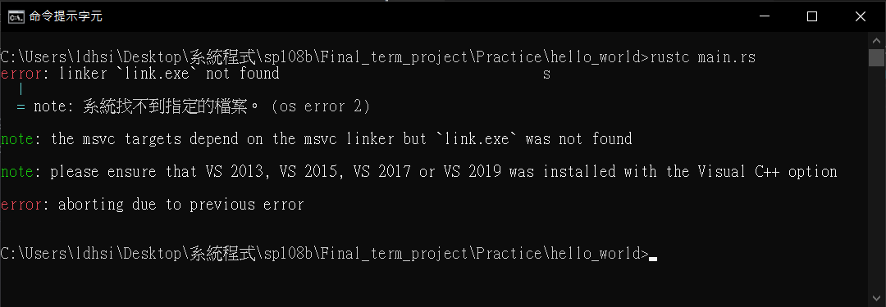
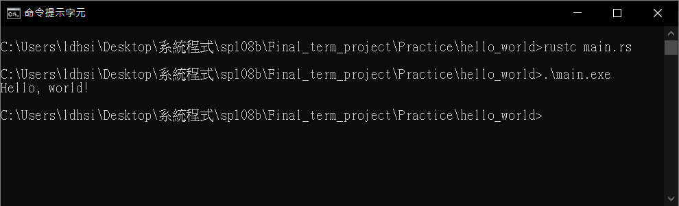
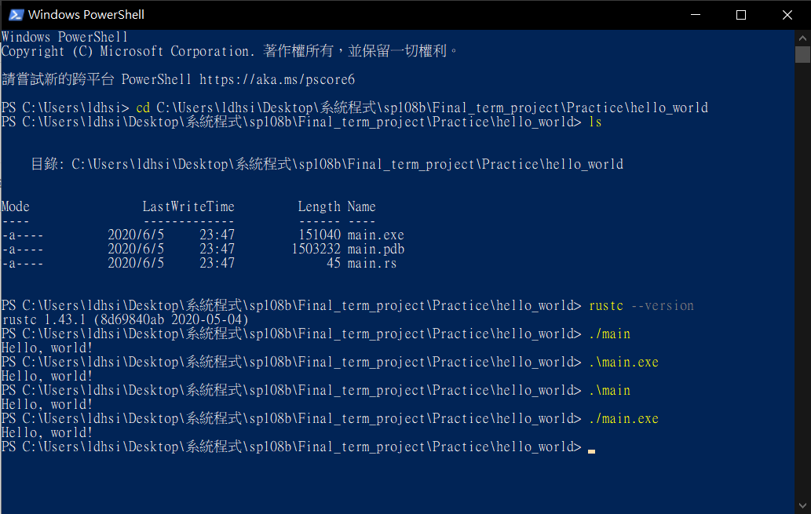

# [Hello World!](README.md#rust-learning)
---

## process

### 1. create a file with ".rs" as its file extension > enter this code :
* ```
    fn main(){
        println!("Hello, world!");
    }
  ```

### 2. open cmd > access to target direction > enter `rustc main.rs`<br>

* then an error showed up 〒.〒
<br>

### 3. I find a solution from [this website](https://www.jaacostan.com/2019/12/rust-error-linker-linkexe-not-found.html)
* [click here](https://visualstudio.microsoft.com/zh-hant/downloads/) > **drop down** > Build Tools for Visual Studio 2019 > Build Tools for Visual Studio 2019 > download & install > choose `C++ build tools` before install

### 4. reboot cmd once everything is installed

### 5. enter `rustc main.rs`

### 6. enter `.\main.exe`
*  I made it. \≧◇≦/


### 7. I find out something. Although [this book](https://kaisery.gitbooks.io/trpl-zh-cn/content/ch01-02-hello-world.html) mentions that we need to use `.\main.exe` to run our programs, the truth is...
* I have THESE ways to run my executable!!!
<br><br>
* After figuring it out, I start using Microsoft PowerShell as my tool on running Rust programs.

## analysis

### 1. function `main`
* ```
  fn main(){  

  }
  ```

* `main` is a special function, which always runs first.

### 2. `println!("Hello, world!");`
* `println!` prints `Hello, world!` as a variable, and end the code with a `semicolon` aka `;` .