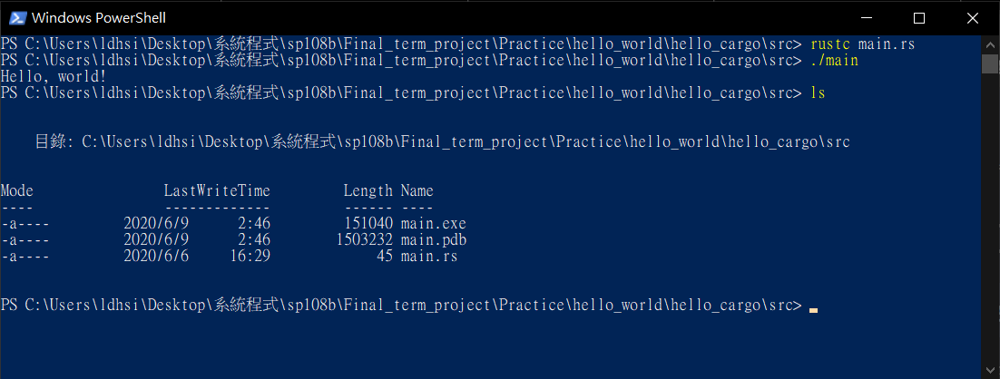
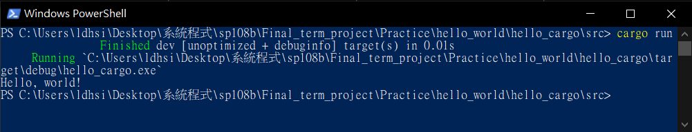

# [Hello Cargo](README.md#rust-learning)
---

## process

### 1.  `cd` to target directory within Microsoft PowerShell

### 2.  enter `cargo --version` to make sure `cargo` is available

### 3.  enter `cargo new hello_cargo` to create a cargo directory

### 4.  `cd` to `hello_cargo` and `tree. /f` it
* you'll see...<br><br>
<br><br>
* this step creates one directory and two files in `hello_cargo` directory

### 5. Check out `Cargo.toml`
* you'll see...<br><br>
    ```
    [package]
    name = "hello_cargo"
    version = "0.1.0"
    authors = ["ArthurLiao0816 <ArthurLiao0816@yahoo.com>"]
    edition = "2018"

    # See more keys and their definitions at https://doc.rust-lang.org/cargo/reference/manifest.html

    [dependencies]
    ```
* `[package]` defines a package<br>
* `name` is the name of this package<br>
* `version` is the version of this package<br>
    * `"x.y.z"` :
    * `x` : MAJOR version when you make incompatible API changes.<br>
    * `y` : MINOR version when you add functionality in a backwards compatible manner.<br>
    * `z` : PATCH version when you make backwards compatible bug fixes.<br>
* `authors` is the author of this package<br>

### 6.  `cd` to `src` directory and run the file inside it
* result ( compile -> run executable )<br><br>
    
* result ( using `cargo run` )<br><br>
    
## [References](References.md#Ch3.)