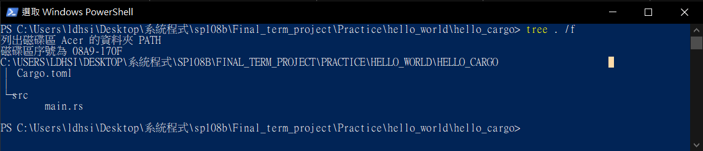

# [Hello Cargo](README.md#rust-learning)
---

## process

### 1.  `cd` to target directory within Microsoft PowerShell

### 2.  enter `cargo --version` to make sure `cargo` is available

### 3.  enter `cargo new hello_cargo` to create a cargo directory

### 4.  `cd` to `hello_cargo` and `ls` it
* you'll see...  
  
* this step creates one directory and two files in `hello_cargo` directory

## [References](References.md#Ch3.)