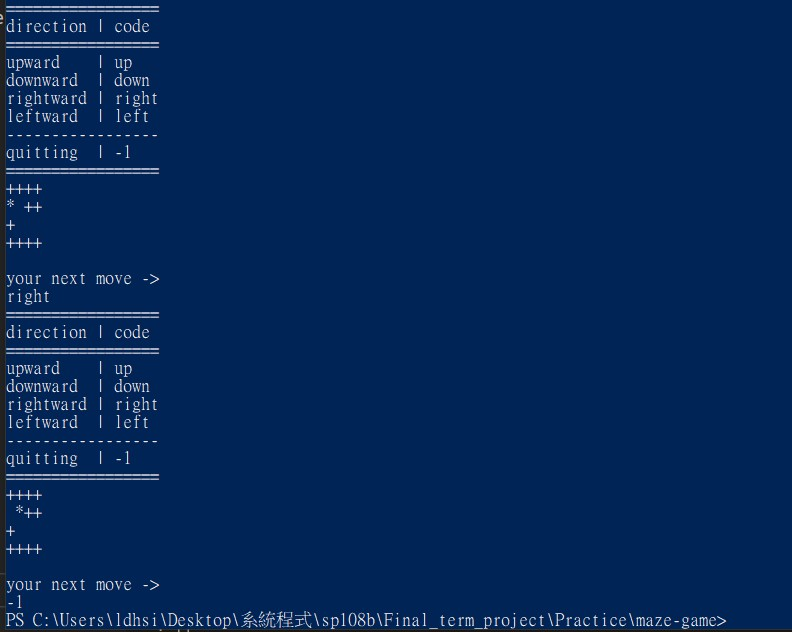
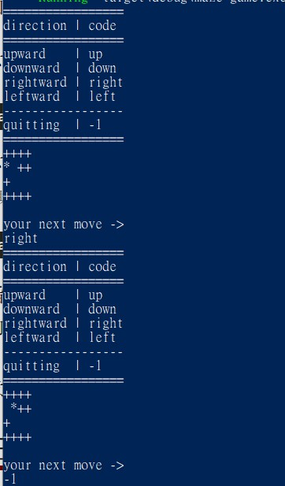
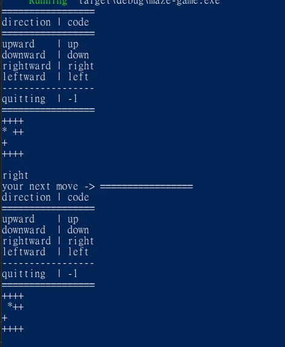

# [Interesting Things](README.md#rust-learning)

## Program reads input before printing
* there are 3 situations ...
    1. `println!("your next move -> ");`  
    * program reads printing before input ...
    
    2. `print!("your next move -> ");` 
        `print!("\n");`  
    * program reads printing before input ...
    
    3. `print!("your next move -> ");`  
    * Program reads input before printing ...
    

## [References](References.md#Ch5.)