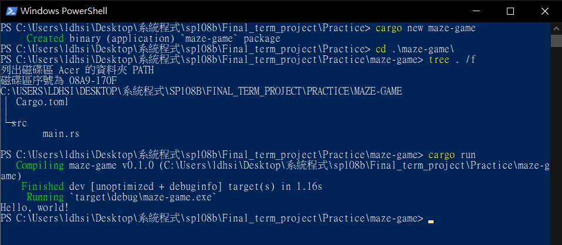

# [Maze Game](README.md#rust-learning)
---

## process
1. create a new project directory
    * `cargo new maze-game`
    * `cd maze-game`
    * `tree . /f`
    <br><br>

2. write a maze game with **C** first
    * If you wanna make a maze game, you need a maze. This is my maze.
        ```
        int maze[row][column] = {  {1, 1, 1, 1},    
                                    {0, 0, 1, 1},
                                    {1, 0, 0, 0},
                                    {1, 1, 1, 1}    };
        ```

    * Then, I need to know where is my player, so I save its position within a matrix.
        ```
        int player_position[2] = {1, 0};
        ```

    * So far, both of my maze and player are just datas. If people wanna play it, they won't know how the status in the maze after they make a movement. So, I make the game visualized by using '+', '*', and ' ', as obstacles, player, and path, respectively.
        ```
        void maze_status(){
            for(i = 0; i < row; i++){
                for(j = 0; j < column; j++){
                    if((i == player_position[0]) && (j == player_position[1])){
                        printf("*");
                    }
                    else if(maze[i][j] == 1){
                        printf("+");
                    }
                    else printf(" ");
                }
                printf("\n");
            }
            printf("\n");

            return 0;
        }
        ```
    
    * If people wanna play this game, they need to make movement by entering specific instructions. So I make an instruction function to let them know options they have.
        ```
        void instruction(){
            printf("=================\n");
            printf("direction | code\n");
            printf("=================\n");
            printf("upward    | up\n");
            printf("downward  | down\n");
            printf("rightward | right\n");
            printf("leftward  | left\n");
            printf("-----------------\n");
            printf("quitting  | -1\n");
            printf("=================\n\n");

            return 0;
        }
        ```
    
    * When player makes a movement, its position needs to be changed.
        ```
        void player_move(){
            if(strstr(movement, "up") && maze[player_position[0] - 1][player_position[1]] != 1){
                player_position[0] -= 1;
            }
            else if(strstr(movement, "down") && maze[player_position[0] + 1][player_position[1]] != 1){
                player_position[0] += 1;
            }
            else if(strstr(movement, "right") && maze[player_position[0]][player_position[1] + 1] != 1){
                player_position[1] += 1;
            }
            else if(strstr(movement, "left") && maze[player_position[0]][player_position[1] - 1] != 1){
                player_position[1] -= 1;
            }
            else return 0;
            printf("%d %d\n", player_position[0], player_position[1]);

            for(i = 0; i < 5; i++){
                movement[i] = "";
            }

            return 0;
        }
        ```
        <br>

3. then we transfer this game from **C** to **Rust**
    * 

## [References](References.md#Ch5.)