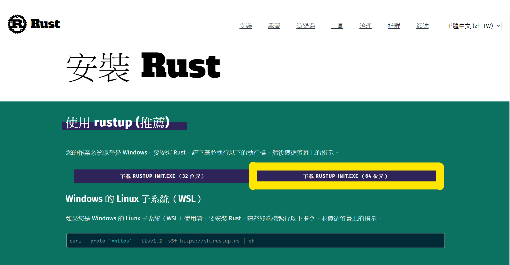
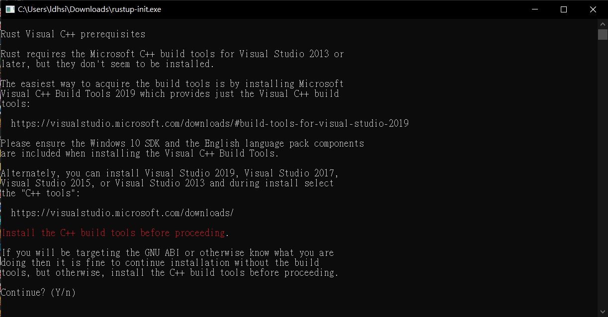
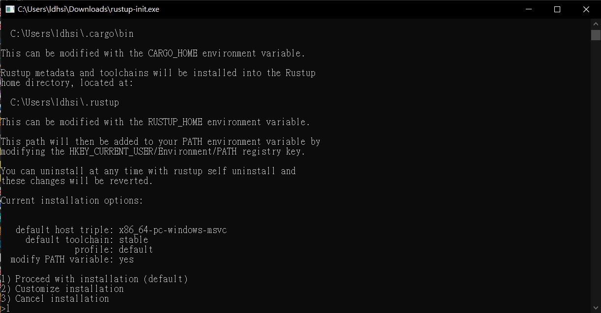
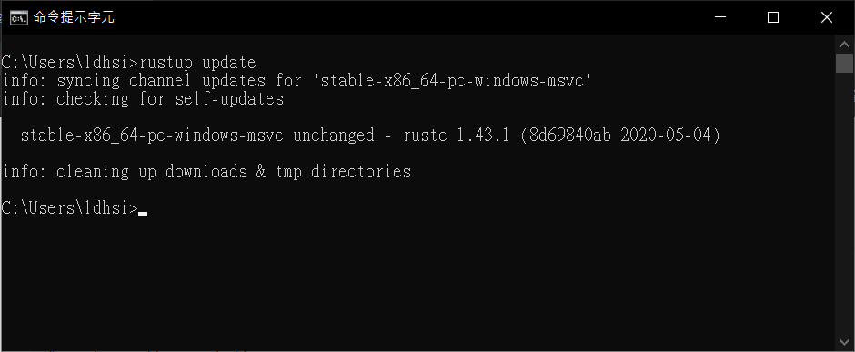
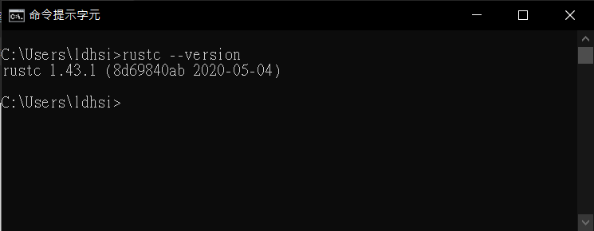

# [Setting up](README.md#rust-learning)
---

## On Windows
---
### 1. Install `rustup` from [HERE](https://www.rust-lang.org/zh-TW/tools/install) 
* 
### 2. Run the executable(input 'y') 
 

### 3. Update and Check 
* open Command Prompt(cmd) 
* using `rustup update` to update 
 
* using `rustc --version` to check if you install `rustup` successfully 
* SUCCESS! 
 